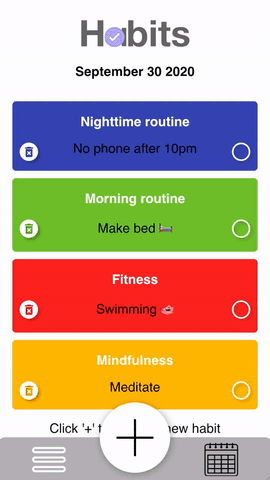
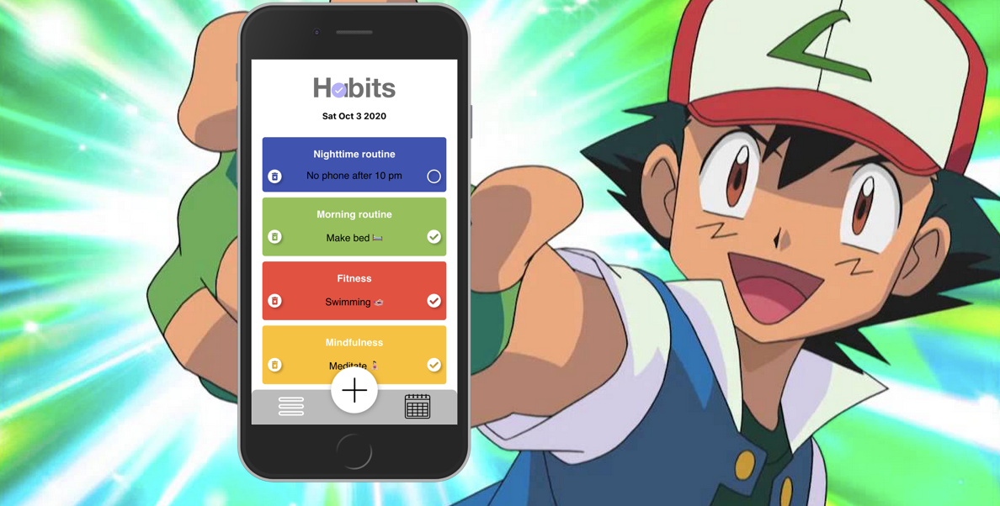

---

 „This year I REALLY am determined to go to the gym more often!“ - Sounds familiar? ‚Habits‘ helps you build your aspired habits by providing a clear overview. The integrated calendar keeps track of your completed habits, helping with reflecting and improving so you can stick to your goals.

This app is my final project I developed during the neuefische Web Development Bootcamp in September 2020 in Hamburg, Germany.

[Demo](https://capstone-project-nine.vercel.app/)

<b align="left">..even Ash wants to track 'em all!</b>

 
 
 

## Tech stack

- React
- React Hooks
- React Router
- styled-components
- uuid
- Storybook
- React Testing Library
- Cypress

## Project setup

- Clone this repository.

- Install all npm dependencies `npm install`

- To run the app in development mode `npm start`, then open http://localhost:3000 to view it in the browser

- To run Storybook: `npm run storybook`

- To run unit and component tests: `npm test`
